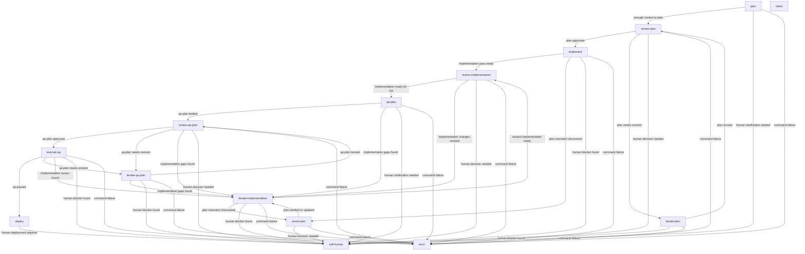

# Available Commands

This file documents the DWP workflow commands available in this repository.
There commands are meant to be called by a DWP runner, not directly by humans or agents.

The documentation is meant to be a reference for workflow authors and maintainers, and for smart states that have freedom to choose the next state.

## Workflow Map

Notes:
- `revisit-plan` is only entered by the implementer side of the workflow.
- `review-implementation` does not send work back to planning; it either hands off to QA, requests implementation changes, or escalates to a human.
- `review-implementation` hands accepted work to QA planning instead of ending the workflow.

## `plan`

Purpose:
- Create the initial plan for a ticket.

Use when:
- A ticket has not been planned yet.
- You want the planner to create the first `## Plan` section in the ticket.

Expected inputs:
- Trailer: `dwp-ticket: <path-to-ticket>`
- Body: optional extra planning instructions

Behavior:
- Starts a fresh opencode planning session titled `<commit-hash>-plan`.
- Reads `SPEC.md`, `IMPLEMENTATION_PLAN.md`, and the ticket.
- Creates or updates the ticket's `## Plan` section.
- Writes a structured output file at `.dwp/logs/dwp-output-<commit-hash>.md`.

Allowed output decisions:
- `review-plan` when there is enough information to create a solid plan.
- `call-human` only when the plan cannot be created without human intervention.

State transitions:
- `review-plan`
- `call-human`
- `error` on command failure

Trailers written on success:
- `dwp-ticket`
- `dwp-plan-version: 1`
- `dwp-planner-session-id`

## `review-plan`

Purpose:
- Review the current ticket plan and decide whether to approve it, request another iteration, or ask for human help.

Use when:
- A plan exists in the ticket.
- The body contains the latest planner or iteration notes intended for the reviewer.

Expected inputs:
- Trailer: `dwp-ticket: <path-to-ticket>`
- Trailer: `dwp-plan-version: <n>`
- Trailer: `dwp-planner-session-id: <session-id>`
- Body: latest notes for the reviewer

Behavior:
- Starts a fresh opencode review session titled `<commit-hash>-review-plan`.
- Reads `SPEC.md`, `IMPLEMENTATION_PLAN.md`, the ticket, and the notes from the body.
- Writes a structured output file at `.dwp/logs/dwp-output-<commit-hash>.md`.
- Reviews the plan as it exists in the ticket at that moment.
- Becomes less nitpicky once `dwp-plan-version >= 3`; another iteration should be requested only for substantive issues.

Allowed output decisions:
- `implement`
- `iterate-plan`
- `call-human`

State transitions:
- `implement`
- `iterate-plan`
- `call-human`
- `error` on command failure

Trailers written on success:
- `dwp-ticket`
- `dwp-plan-version` (preserved)
- `dwp-planner-session-id` (preserved)

## `iterate-plan`

Purpose:
- Revise an existing ticket plan after review feedback.

Use when:
- `review-plan` requested changes.
- The existing planner session should continue.

Expected inputs:
- Trailer: `dwp-ticket: <path-to-ticket>`
- Trailer: `dwp-plan-version: <n>`
- Trailer: `dwp-planner-session-id: <session-id>`
- Body: reviewer feedback for the next plan iteration

Behavior:
- Continues the planner opencode session with title `<commit-hash>-iterate-plan`.
- Reads the ticket and the reviewer feedback from the body.
- Updates the existing `## Plan` section in the ticket.
- Writes a structured output file at `.dwp/logs/dwp-output-<commit-hash>.md`.

Allowed output decisions:
- `review-plan`
- `call-human`

State transitions:
- `review-plan`
- `call-human`
- `error` on command failure

Trailers written on success:
- `dwp-ticket`
- `dwp-plan-version` incremented by 1
- `dwp-planner-session-id` (preserved)

## `implement`

Purpose:
- Create the initial implementation pass for a ticket with an approved plan.

Use when:
- `review-plan` approved the plan for execution.
- The ticket is ready for the first implementation pass.

Expected inputs:
- Trailer: `dwp-ticket: <path-to-ticket>`
- Trailer: `dwp-plan-version: <n>`
- Trailer: `dwp-planner-session-id: <session-id>`
- Body: optional extra implementation instructions

Behavior:
- Starts a fresh opencode implementation session titled `<commit-hash>-implement`.
- Reads `SPEC.md`, `IMPLEMENTATION_PLAN.md`, and the ticket.
- Implements the ticket in the repository.
- Writes a structured output file at `.dwp/logs/dwp-output-<commit-hash>.md`.

Allowed output decisions:
- `review-implementation` when there is enough information to produce a credible implementation pass.
- `revisit-plan` when implementation reveals a plan ambiguity or missing guidance that should go back to the planner.
- `call-human` only when implementation cannot proceed responsibly without human intervention.

State transitions:
- `review-implementation`
- `revisit-plan`
- `call-human`
- `error` on command failure

Trailers written on success:
- `dwp-ticket`
- `dwp-plan-version` (preserved)
- `dwp-planner-session-id` (preserved)
- `dwp-implementation-version: 1`
- `dwp-implementer-session-id`

## `revisit-plan`

Purpose:
- Let the implementer return to the planner with questions or plan-change requests discovered during implementation.

Use when:
- `implement` or `iterate-implementation` hits a real plan ambiguity, contradiction, or missing guidance.
- The planner can likely unblock implementation using existing repo context.

Expected inputs:
- Trailer: `dwp-ticket: <path-to-ticket>`
- Trailer: `dwp-plan-version: <n>`
- Trailer: `dwp-planner-session-id: <session-id>`
- Trailer: `dwp-implementation-version: <n>`
- Trailer: `dwp-implementer-session-id: <session-id>`
- Body: implementer questions, friction, or requested plan changes

Behavior:
- Continues the planner opencode session with title `<commit-hash>-revisit-plan`.
- Reads `SPEC.md`, `IMPLEMENTATION_PLAN.md`, the ticket, and the implementer feedback from the body.
- Inspects current repository state only to understand the implementation issue.
- Updates the existing `## Plan` section when the planner can clarify or adjust the plan.
- Writes a structured output file at `.dwp/logs/dwp-output-<commit-hash>.md`.

Allowed output decisions:
- `iterate-implementation`
- `call-human`

State transitions:
- `iterate-implementation`
- `call-human`
- `error` on command failure

Trailers written on success:
- `dwp-ticket`
- `dwp-plan-version` incremented by 1
- `dwp-planner-session-id` (preserved)
- `dwp-implementation-version` (preserved)
- `dwp-implementer-session-id` (preserved)

## `qa-plan`

Purpose:
- Create the initial QA plan for a ticket whose implementation is ready for QA planning.

Use when:
- `review-implementation` approved the implementation for QA planning.
- You want the QA planner to create the first `## QA Plan` section in the ticket.

Expected inputs:
- Trailer: `dwp-ticket: <path-to-ticket>`
- Trailer: `dwp-plan-version: <n>`
- Trailer: `dwp-planner-session-id: <session-id>`
- Trailer: `dwp-implementation-version: <n>`
- Trailer: `dwp-implementer-session-id: <session-id>`
- Body: optional extra QA planning instructions

Behavior:
- Starts a fresh opencode QA planning session titled `<commit-hash>-qa-plan`.
- Reads `SPEC.md`, `IMPLEMENTATION_PLAN.md`, and the ticket.
- Creates or updates the ticket's `## QA Plan` section.
- Writes a structured output file at `.dwp/logs/dwp-output-<commit-hash>.md`.

Allowed output decisions:
- `review-qa-plan`
- `iterate-implementation`
- `call-human`

State transitions:
- `review-qa-plan`
- `iterate-implementation`
- `call-human`
- `error` on command failure

Trailers written on success:
- `dwp-ticket`
- `dwp-plan-version` (preserved)
- `dwp-planner-session-id` (preserved)
- `dwp-implementation-version` (preserved)
- `dwp-implementer-session-id` (preserved)
- `dwp-qa-plan-version: 1`
- `dwp-qa-planner-session-id`

## `review-qa-plan`

Purpose:
- Review the current QA plan and decide whether to approve it, request another iteration, send work back to implementation, or ask for human help.

Use when:
- A QA plan exists in the ticket.
- The body contains the latest QA planner notes intended for the reviewer.

Expected inputs:
- Trailer: `dwp-ticket: <path-to-ticket>`
- Trailer: `dwp-plan-version: <n>`
- Trailer: `dwp-planner-session-id: <session-id>`
- Trailer: `dwp-implementation-version: <n>`
- Trailer: `dwp-implementer-session-id: <session-id>`
- Trailer: `dwp-qa-plan-version: <n>`
- Trailer: `dwp-qa-planner-session-id: <session-id>`
- Body: latest notes for the reviewer

Behavior:
- Starts a fresh opencode review session titled `<commit-hash>-review-qa-plan`.
- Reads `SPEC.md`, `IMPLEMENTATION_PLAN.md`, the ticket, and the notes from the body.
- Reviews the QA plan as it exists in the ticket at that moment.
- Writes a structured output file at `.dwp/logs/dwp-output-<commit-hash>.md`.

Allowed output decisions:
- `execute-qa`
- `iterate-qa-plan`
- `iterate-implementation`
- `call-human`

State transitions:
- `execute-qa`
- `iterate-qa-plan`
- `iterate-implementation`
- `call-human`
- `error` on command failure

Trailers written on success:
- `dwp-ticket`
- `dwp-plan-version` (preserved)
- `dwp-planner-session-id` (preserved)
- `dwp-implementation-version` (preserved)
- `dwp-implementer-session-id` (preserved)
- `dwp-qa-plan-version` (preserved)
- `dwp-qa-planner-session-id` (preserved)

## `iterate-qa-plan`

Purpose:
- Revise an existing QA plan after review feedback.

Use when:
- `review-qa-plan` requested changes.
- The existing QA planner session should continue.

Expected inputs:
- Trailer: `dwp-ticket: <path-to-ticket>`
- Trailer: `dwp-plan-version: <n>`
- Trailer: `dwp-planner-session-id: <session-id>`
- Trailer: `dwp-implementation-version: <n>`
- Trailer: `dwp-implementer-session-id: <session-id>`
- Trailer: `dwp-qa-plan-version: <n>`
- Trailer: `dwp-qa-planner-session-id: <session-id>`
- Body: reviewer feedback for the next QA plan iteration

Behavior:
- Continues the QA planner opencode session with title `<commit-hash>-iterate-qa-plan`.
- Reads the ticket and the reviewer feedback from the body.
- Updates the existing `## QA Plan` section in the ticket.
- Writes a structured output file at `.dwp/logs/dwp-output-<commit-hash>.md`.

Allowed output decisions:
- `review-qa-plan`
- `iterate-implementation`
- `call-human`

State transitions:
- `review-qa-plan`
- `iterate-implementation`
- `call-human`
- `error` on command failure

Trailers written on success:
- `dwp-ticket`
- `dwp-plan-version` (preserved)
- `dwp-planner-session-id` (preserved)
- `dwp-implementation-version` (preserved)
- `dwp-implementer-session-id` (preserved)
- `dwp-qa-plan-version` incremented by 1
- `dwp-qa-planner-session-id` (preserved)

## `review-implementation`

Purpose:
- Review the current implementation and decide whether to hand it off to QA planning, request another implementation pass, or ask for human help.

Use when:
- An implementation pass exists in the worktree.
- The body contains the latest implementer notes intended for the reviewer.

Expected inputs:
- Trailer: `dwp-ticket: <path-to-ticket>`
- Trailer: `dwp-plan-version: <n>`
- Trailer: `dwp-planner-session-id: <session-id>`
- Trailer: `dwp-implementation-version: <n>`
- Trailer: `dwp-implementer-session-id: <session-id>`
- Body: latest notes for the reviewer

Behavior:
- Starts a fresh opencode review session titled `<commit-hash>-review-implementation`.
- Reads `SPEC.md`, `IMPLEMENTATION_PLAN.md`, the ticket, and the notes from the body.
- Reviews the implementation as it exists in the repository at that moment.
- Writes a structured output file at `.dwp/logs/dwp-output-<commit-hash>.md`.
- Becomes less nitpicky once `dwp-implementation-version >= 3`; another iteration should be requested only for substantive issues.

Allowed output decisions:
- `qa-plan`
- `iterate-implementation`
- `call-human`

State transitions:
- `qa-plan`
- `iterate-implementation`
- `call-human`
- `error` on command failure

Trailers written on success:
- `dwp-ticket`
- `dwp-plan-version` (preserved)
- `dwp-planner-session-id` (preserved)
- `dwp-implementation-version` (preserved)
- `dwp-implementer-session-id` (preserved)

## `execute-qa`

Purpose:
- Execute the current QA plan and decide whether the work is ready for deployment handoff.

Use when:
- `review-qa-plan` approved the QA plan.
- The repository is ready for QA execution.

Expected inputs:
- Trailer: `dwp-ticket: <path-to-ticket>`
- Trailer: `dwp-plan-version: <n>`
- Trailer: `dwp-planner-session-id: <session-id>`
- Trailer: `dwp-implementation-version: <n>`
- Trailer: `dwp-implementer-session-id: <session-id>`
- Trailer: `dwp-qa-plan-version: <n>`
- Trailer: `dwp-qa-planner-session-id: <session-id>`
- Body: optional extra QA execution instructions

Behavior:
- Starts a fresh opencode QA execution session titled `<commit-hash>-execute-qa`.
- Reads `SPEC.md`, `IMPLEMENTATION_PLAN.md`, and the ticket.
- Executes the QA work it can reasonably perform in the repository.
- Writes a structured output file at `.dwp/logs/dwp-output-<commit-hash>.md`.

Allowed output decisions:
- `deploy`
- `iterate-qa-plan`
- `iterate-implementation`
- `call-human`

State transitions:
- `deploy`
- `iterate-qa-plan`
- `iterate-implementation`
- `call-human`
- `error` on command failure

Trailers written on success:
- `dwp-ticket`
- `dwp-plan-version` (preserved)
- `dwp-planner-session-id` (preserved)
- `dwp-implementation-version` (preserved)
- `dwp-implementer-session-id` (preserved)
- `dwp-qa-plan-version` (preserved)
- `dwp-qa-planner-session-id` (preserved)

## `deploy`

Purpose:
- Hand off a QA-approved ticket for human deployment.

Use when:
- `execute-qa` passed and deployment requires a human action.

Behavior:
- Creates a `call-human` state with deployment handoff instructions.

State transitions:
- `call-human`
- `error` on command failure

## `iterate-implementation`

Purpose:
- Revise an existing implementation after review feedback.

Use when:
- `review-implementation` requested changes.
- The existing implementer session should continue.

Expected inputs:
- Trailer: `dwp-ticket: <path-to-ticket>`
- Trailer: `dwp-plan-version: <n>`
- Trailer: `dwp-planner-session-id: <session-id>`
- Trailer: `dwp-implementation-version: <n>`
- Trailer: `dwp-implementer-session-id: <session-id>`
- Body: reviewer feedback for the next implementation iteration

Behavior:
- Continues the implementer opencode session with title `<commit-hash>-iterate-implementation`.
- Reads `SPEC.md`, `IMPLEMENTATION_PLAN.md`, the ticket, and the reviewer feedback from the body.
- Updates the repository implementation to address the review feedback.
- Writes a structured output file at `.dwp/logs/dwp-output-<commit-hash>.md`.

Allowed output decisions:
- `review-implementation`
- `revisit-plan`
- `call-human`

State transitions:
- `review-implementation`
- `revisit-plan`
- `call-human`
- `error` on command failure

Trailers written on success:
- `dwp-ticket`
- `dwp-plan-version` (preserved)
- `dwp-planner-session-id` (preserved)
- `dwp-implementation-version` incremented by 1
- `dwp-implementer-session-id` (preserved)

## `clean`

Purpose:
- Clean up the worktree and mark the workflow as done.

Use when:
- The workflow is finished and the temporary worktree should be removed.

Behavior:
- Creates an empty commit with message `chore: aynig is done`.
- Removes the worktree at `$AYNIG_WORKTREE_PATH`.

State transitions:
- None managed through `aynig set-state`; this is a cleanup helper.
